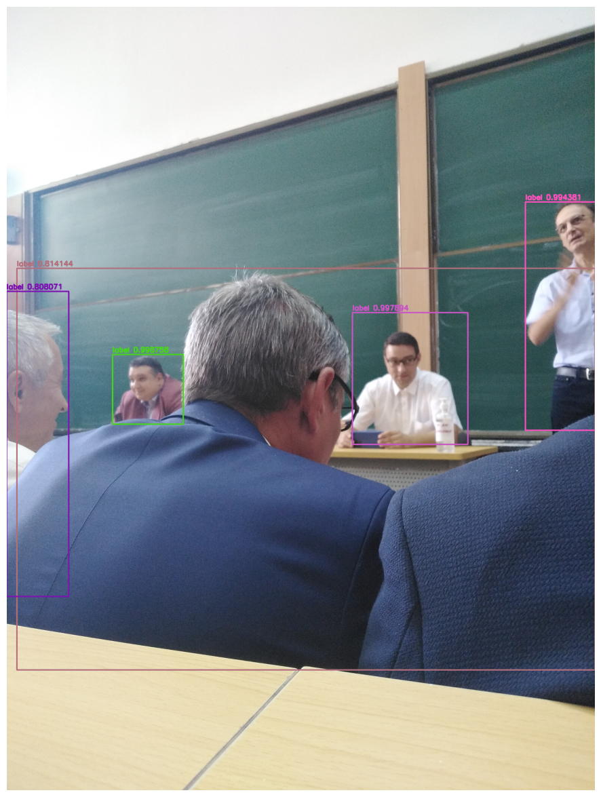

<h1>Introduction in Neural Networks in Python ISB Course</h1>
 
<h2>Features</h2>
<ul>
  <li>Creating a NN Class from Zero</li>
  <li>Working with tensorflow</li>
  <li>Using fashion mnist dataset</li>
  <li>Display the images using plot</li>
  <li>Data numerical graphs accuracy & loss</li>
  <li>Confusion matrix</li>
  <li>Regularization l1 and l2</li>
  <li>CNN</li>
  <li>Yolov3</li>
</ul>
  
<h2>Acknowledgments</h2>

<b> Python3: http://bit.ly/python3-certifications <b>
 
<b> Machine Learning: https://bit.ly/machine-learning-certification <b>

<h2>Photo</h2>

 

<h2>Contact</h2>

<b> Email: mariusc0023@gmail.com </b>
